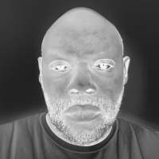
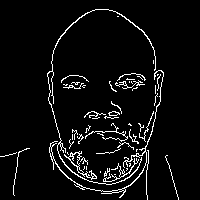

# OpenCV Matrix Assignment Report

**Student:** Samuel Collins  
**Date:** 2026-08-31

## 1. Objective

This report demonstrates that a digital image is a numerical matrix rather than only a visual object. An image captured on a mobile phone is converted to 200 x 200 pixels, its pixel values are exported to CSV matrices, several OpenCV operations are applied, and selected operations are verified against manual matrix calculations.

## 2. Image Acquisition and Preparation

The source photograph was captured with a mobile phone and stored as `input/image_original.jpg`, then resized to 200 x 200 pixels with `cv2.resize` using `INTER_AREA` interpolation and saved as `input/image_200x200.png`.


### Image Properties

The properties below were read from the final 200 x 200 image with OpenCV and are stored in `csv_full_image/image_metadata.csv`.

| property              | value         |
|:----------------------|:--------------|
| width                 | 200           |
| height                | 200           |
| channels              | 3             |
| shape                 | (200, 200, 3) |
| dtype                 | uint8         |
| channel_order         | BGR           |
| min_pixel_value       | 1             |
| max_pixel_value       | 227           |
| mean_pixel_value      | 149.1377      |
| std_pixel_value       | 63.6612       |
| gray_min_pixel_value  | 2             |
| gray_max_pixel_value  | 224           |
| gray_mean_pixel_value | 150.2941      |
| gray_std_pixel_value  | 63.6493       |

**Channel order.** `cv2.imread` loads a color image in **BGR order**, not RGB order. Index 0 of the third axis is blue, index 1 is green, and index 2 is red. All channel matrices in this report follow that convention, and `cv2.split` returns the channels in the same B, G, R sequence.

## 3. The Image as a Numerical Matrix

Each channel of the 200 x 200 image is exported in full to `csv_full_image/` as a 200 x 200 grid of integers in the range 0-255. Each file contains numerical values only, with no row names, column headers, or DataFrame index. Because a full grid is too large to print, the top-left 8 x 8 corner of each channel is shown below; the complete values are in the CSV files.

### Grayscale (`image_gray_200x200.csv`)

|    |   c0 |   c1 |   c2 |   c3 |   c4 |   c5 |   c6 |   c7 |
|:---|-----:|-----:|-----:|-----:|-----:|-----:|-----:|-----:|
| r0 |  199 |  200 |  200 |  200 |  200 |  200 |  200 |  200 |
| r1 |  199 |  199 |  199 |  200 |  199 |  199 |  200 |  201 |
| r2 |  199 |  200 |  200 |  200 |  199 |  200 |  200 |  201 |
| r3 |  200 |  200 |  199 |  200 |  199 |  200 |  200 |  201 |
| r4 |  199 |  200 |  200 |  199 |  199 |  200 |  199 |  200 |
| r5 |  200 |  199 |  199 |  200 |  200 |  199 |  199 |  200 |
| r6 |  200 |  200 |  199 |  199 |  200 |  199 |  200 |  200 |
| r7 |  199 |  200 |  198 |  200 |  200 |  200 |  199 |  200 |

### Blue channel (`image_blue_200x200.csv`)

|    |   c0 |   c1 |   c2 |   c3 |   c4 |   c5 |   c6 |   c7 |
|:---|-----:|-----:|-----:|-----:|-----:|-----:|-----:|-----:|
| r0 |  194 |  195 |  195 |  195 |  195 |  195 |  196 |  196 |
| r1 |  194 |  194 |  194 |  195 |  194 |  194 |  196 |  197 |
| r2 |  194 |  195 |  195 |  195 |  194 |  195 |  195 |  196 |
| r3 |  195 |  195 |  194 |  195 |  194 |  195 |  195 |  196 |
| r4 |  194 |  195 |  195 |  194 |  194 |  195 |  194 |  195 |
| r5 |  195 |  194 |  194 |  195 |  195 |  194 |  194 |  195 |
| r6 |  194 |  194 |  194 |  194 |  195 |  194 |  195 |  195 |
| r7 |  193 |  194 |  193 |  195 |  195 |  195 |  194 |  195 |

### Green channel (`image_green_200x200.csv`)

|    |   c0 |   c1 |   c2 |   c3 |   c4 |   c5 |   c6 |   c7 |
|:---|-----:|-----:|-----:|-----:|-----:|-----:|-----:|-----:|
| r0 |  201 |  202 |  202 |  202 |  202 |  201 |  202 |  201 |
| r1 |  201 |  201 |  201 |  202 |  201 |  201 |  202 |  202 |
| r2 |  201 |  202 |  202 |  202 |  201 |  201 |  201 |  202 |
| r3 |  202 |  202 |  201 |  202 |  201 |  202 |  202 |  203 |
| r4 |  201 |  202 |  202 |  201 |  201 |  202 |  201 |  202 |
| r5 |  202 |  201 |  201 |  202 |  202 |  201 |  201 |  202 |
| r6 |  202 |  202 |  201 |  201 |  202 |  201 |  202 |  202 |
| r7 |  201 |  201 |  200 |  202 |  202 |  202 |  201 |  202 |

### Red channel (`image_red_200x200.csv`)

|    |   c0 |   c1 |   c2 |   c3 |   c4 |   c5 |   c6 |   c7 |
|:---|-----:|-----:|-----:|-----:|-----:|-----:|-----:|-----:|
| r0 |  198 |  199 |  199 |  199 |  199 |  199 |  199 |  199 |
| r1 |  198 |  198 |  198 |  199 |  198 |  198 |  199 |  200 |
| r2 |  198 |  199 |  199 |  199 |  198 |  199 |  199 |  200 |
| r3 |  199 |  199 |  198 |  199 |  198 |  199 |  199 |  200 |
| r4 |  198 |  199 |  199 |  198 |  198 |  199 |  198 |  199 |
| r5 |  199 |  198 |  198 |  199 |  199 |  198 |  198 |  199 |
| r6 |  199 |  199 |  198 |  198 |  199 |  198 |  199 |  199 |
| r7 |  198 |  199 |  197 |  199 |  199 |  199 |  198 |  199 |

### Grayscale Calculation

Grayscale conversion is a weighted sum of the three color channels rather than a plain average. The weights reflect how sensitive human vision is to each color: the eye is most sensitive to green, less to red, and least to blue. OpenCV uses

```
I_gray = round(0.114 * B + 0.587 * G + 0.299 * R)
```

with the channels taken in BGR order as loaded by `cv2.imread`. The weights sum to 1.0, so the result stays within the original 0-255 range.

The equation was applied by hand to 5 pixels taken from different locations in the image and compared against the value OpenCV produced.

|   row |   column |   B |   G |   R |   manual_gray |   opencv_gray |   difference |
|------:|---------:|----:|----:|----:|--------------:|--------------:|-------------:|
|     0 |        0 | 194 | 201 | 198 |           199 |           199 |            0 |
|    50 |      150 |  84 |  83 |  92 |            86 |            86 |            0 |
|   100 |      100 |  79 |  93 | 146 |           107 |           107 |            0 |
|   150 |       50 | 114 | 130 | 133 |           129 |           129 |            0 |
|   199 |      199 | 147 | 160 | 162 |           159 |           159 |            0 |

Every manually calculated value matches OpenCV exactly, confirming the weighted equation is the operation OpenCV performs.

## 4. OpenCV Operations

Each operation below was applied to the prepared image. The resulting image is saved in `output_images/` and its full pixel matrix is saved in `csv_full_image/`.

### Grayscale

Converts the three BGR channels into a single intensity channel.


Top-left 8 x 8 corner of `grayscale_matrix.csv`:

|    |   c0 |   c1 |   c2 |   c3 |   c4 |   c5 |   c6 |   c7 |
|:---|-----:|-----:|-----:|-----:|-----:|-----:|-----:|-----:|
| r0 |  199 |  200 |  200 |  200 |  200 |  200 |  200 |  200 |
| r1 |  199 |  199 |  199 |  200 |  199 |  199 |  200 |  201 |
| r2 |  199 |  200 |  200 |  200 |  199 |  200 |  200 |  201 |
| r3 |  200 |  200 |  199 |  200 |  199 |  200 |  200 |  201 |
| r4 |  199 |  200 |  200 |  199 |  199 |  200 |  199 |  200 |
| r5 |  200 |  199 |  199 |  200 |  200 |  199 |  199 |  200 |
| r6 |  200 |  200 |  199 |  199 |  200 |  199 |  200 |  200 |
| r7 |  199 |  200 |  198 |  200 |  200 |  200 |  199 |  200 |

### Negative

Inverts every intensity value as `255 - pixel`.



Top-left 8 x 8 corner of `negative_matrix.csv`:

|    |   c0 |   c1 |   c2 |   c3 |   c4 |   c5 |   c6 |   c7 |
|:---|-----:|-----:|-----:|-----:|-----:|-----:|-----:|-----:|
| r0 |   56 |   55 |   55 |   55 |   55 |   55 |   55 |   55 |
| r1 |   56 |   56 |   56 |   55 |   56 |   56 |   55 |   54 |
| r2 |   56 |   55 |   55 |   55 |   56 |   55 |   55 |   54 |
| r3 |   55 |   55 |   56 |   55 |   56 |   55 |   55 |   54 |
| r4 |   56 |   55 |   55 |   56 |   56 |   55 |   56 |   55 |
| r5 |   55 |   56 |   56 |   55 |   55 |   56 |   56 |   55 |
| r6 |   55 |   55 |   56 |   56 |   55 |   56 |   55 |   55 |
| r7 |   56 |   55 |   57 |   55 |   55 |   55 |   56 |   55 |

### Threshold

Maps intensities to 0 or 255 using a fixed cutoff of 127.


Top-left 8 x 8 corner of `threshold_matrix.csv`:

|    |   c0 |   c1 |   c2 |   c3 |   c4 |   c5 |   c6 |   c7 |
|:---|-----:|-----:|-----:|-----:|-----:|-----:|-----:|-----:|
| r0 |  255 |  255 |  255 |  255 |  255 |  255 |  255 |  255 |
| r1 |  255 |  255 |  255 |  255 |  255 |  255 |  255 |  255 |
| r2 |  255 |  255 |  255 |  255 |  255 |  255 |  255 |  255 |
| r3 |  255 |  255 |  255 |  255 |  255 |  255 |  255 |  255 |
| r4 |  255 |  255 |  255 |  255 |  255 |  255 |  255 |  255 |
| r5 |  255 |  255 |  255 |  255 |  255 |  255 |  255 |  255 |
| r6 |  255 |  255 |  255 |  255 |  255 |  255 |  255 |  255 |
| r7 |  255 |  255 |  255 |  255 |  255 |  255 |  255 |  255 |

### Gaussian Blur

Smooths the image by convolving with a 5x5 Gaussian kernel.


Top-left 8 x 8 corner of `gaussian_blur_matrix.csv`:

|    |   c0 |   c1 |   c2 |   c3 |   c4 |   c5 |   c6 |   c7 |
|:---|-----:|-----:|-----:|-----:|-----:|-----:|-----:|-----:|
| r0 |  199 |  199 |  200 |  200 |  200 |  200 |  200 |  200 |
| r1 |  199 |  199 |  200 |  200 |  200 |  200 |  200 |  200 |
| r2 |  200 |  200 |  200 |  200 |  200 |  200 |  200 |  200 |
| r3 |  200 |  200 |  200 |  200 |  200 |  200 |  200 |  200 |
| r4 |  200 |  200 |  200 |  199 |  199 |  200 |  200 |  200 |
| r5 |  200 |  200 |  199 |  199 |  200 |  199 |  200 |  200 |
| r6 |  200 |  199 |  199 |  199 |  200 |  200 |  200 |  200 |
| r7 |  200 |  199 |  199 |  199 |  200 |  200 |  200 |  200 |

### Canny

Detects edges using gradient thresholds of 100 and 200.



Top-left 8 x 8 corner of `canny_matrix.csv`:

|    |   c0 |   c1 |   c2 |   c3 |   c4 |   c5 |   c6 |   c7 |
|:---|-----:|-----:|-----:|-----:|-----:|-----:|-----:|-----:|
| r0 |    0 |    0 |    0 |    0 |    0 |    0 |    0 |    0 |
| r1 |    0 |    0 |    0 |    0 |    0 |    0 |    0 |    0 |
| r2 |    0 |    0 |    0 |    0 |    0 |    0 |    0 |    0 |
| r3 |    0 |    0 |    0 |    0 |    0 |    0 |    0 |    0 |
| r4 |    0 |    0 |    0 |    0 |    0 |    0 |    0 |    0 |
| r5 |    0 |    0 |    0 |    0 |    0 |    0 |    0 |    0 |
| r6 |    0 |    0 |    0 |    0 |    0 |    0 |    0 |    0 |
| r7 |    0 |    0 |    0 |    0 |    0 |    0 |    0 |    0 |

### Contour Measurements

|   contour_id |   area |   perimeter |   points |
|-------------:|-------:|------------:|---------:|
|            0 |  39601 |         796 |        4 |

## 5. Manual Verification

A 7 x 7 patch was extracted from the grayscale matrix and each selected operation was computed by hand, then compared against the OpenCV result element by element. A maximum absolute difference of 0 confirms the manual calculation reproduces OpenCV exactly.

### Input Patch

|    |   c0 |   c1 |   c2 |   c3 |   c4 |   c5 |   c6 |
|:---|-----:|-----:|-----:|-----:|-----:|-----:|-----:|
| r0 |  199 |  200 |  200 |  200 |  200 |  200 |  200 |
| r1 |  199 |  199 |  199 |  200 |  199 |  199 |  200 |
| r2 |  199 |  200 |  200 |  200 |  199 |  200 |  200 |
| r3 |  200 |  200 |  199 |  200 |  199 |  200 |  200 |
| r4 |  199 |  200 |  200 |  199 |  199 |  200 |  199 |
| r5 |  200 |  199 |  199 |  200 |  200 |  199 |  199 |
| r6 |  200 |  200 |  199 |  199 |  200 |  199 |  200 |

### Summary

| operation_id   | operation              |   max_abs_difference |   mean_abs_difference | result   |
|:---------------|:-----------------------|---------------------:|----------------------:|:---------|
| op01           | Negative (255 - pixel) |                    0 |                     0 | MATCH    |

### OP01 - Negative (255 - pixel)

**Manual output**

|    |   c0 |   c1 |   c2 |   c3 |   c4 |   c5 |   c6 |
|:---|-----:|-----:|-----:|-----:|-----:|-----:|-----:|
| r0 |   56 |   55 |   55 |   55 |   55 |   55 |   55 |
| r1 |   56 |   56 |   56 |   55 |   56 |   56 |   55 |
| r2 |   56 |   55 |   55 |   55 |   56 |   55 |   55 |
| r3 |   55 |   55 |   56 |   55 |   56 |   55 |   55 |
| r4 |   56 |   55 |   55 |   56 |   56 |   55 |   56 |
| r5 |   55 |   56 |   56 |   55 |   55 |   56 |   56 |
| r6 |   55 |   55 |   56 |   56 |   55 |   56 |   55 |

**OpenCV output**

|    |   c0 |   c1 |   c2 |   c3 |   c4 |   c5 |   c6 |
|:---|-----:|-----:|-----:|-----:|-----:|-----:|-----:|
| r0 |   56 |   55 |   55 |   55 |   55 |   55 |   55 |
| r1 |   56 |   56 |   56 |   55 |   56 |   56 |   55 |
| r2 |   56 |   55 |   55 |   55 |   56 |   55 |   55 |
| r3 |   55 |   55 |   56 |   55 |   56 |   55 |   55 |
| r4 |   56 |   55 |   55 |   56 |   56 |   55 |   56 |
| r5 |   55 |   56 |   56 |   55 |   55 |   56 |   56 |
| r6 |   55 |   55 |   56 |   56 |   55 |   56 |   55 |

**Difference (manual - OpenCV)**

|    |   c0 |   c1 |   c2 |   c3 |   c4 |   c5 |   c6 |
|:---|-----:|-----:|-----:|-----:|-----:|-----:|-----:|
| r0 |    0 |    0 |    0 |    0 |    0 |    0 |    0 |
| r1 |    0 |    0 |    0 |    0 |    0 |    0 |    0 |
| r2 |    0 |    0 |    0 |    0 |    0 |    0 |    0 |
| r3 |    0 |    0 |    0 |    0 |    0 |    0 |    0 |
| r4 |    0 |    0 |    0 |    0 |    0 |    0 |    0 |
| r5 |    0 |    0 |    0 |    0 |    0 |    0 |    0 |
| r6 |    0 |    0 |    0 |    0 |    0 |    0 |    0 |

Maximum absolute difference: **0** (MATCH).

## 6. Conclusion

Every operation applied through OpenCV corresponds to an arithmetic transformation of the underlying pixel matrix. The manual calculations reproduce the OpenCV results exactly, confirming that image processing is matrix processing.
