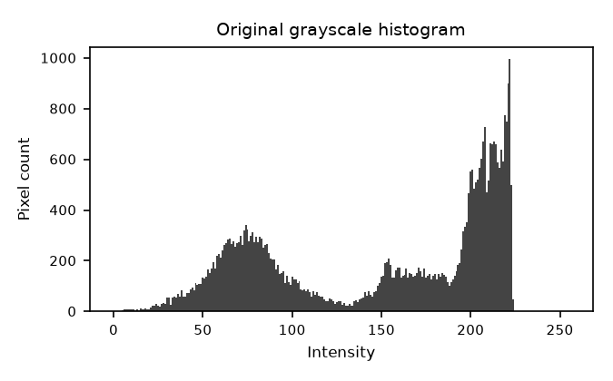
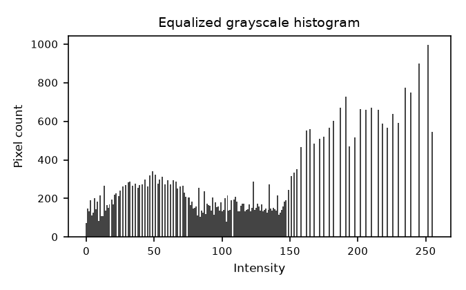
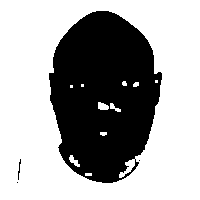
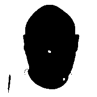
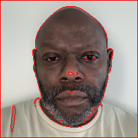

# OpenCV Matrix Assignment Report

**Student:** Samuel Collins  
**Date:** 2026-08-31

## 1. Objective

This report demonstrates that a digital image is a numerical matrix rather than only a visual object. An image captured on a mobile phone is converted to 200 x 200 pixels, its pixel values are exported to CSV matrices, several OpenCV operations are applied, and selected operations are verified against manual matrix calculations.

## 2. Image Acquisition and Preparation

The source photograph was captured with a mobile phone and stored as `input/image_original.jpg`, then resized to 200 x 200 pixels with `cv2.resize` using `INTER_AREA` interpolation and saved as `input/image_200x200.png`.


### Image Properties

The properties below were read from the final 200 x 200 image with OpenCV and are stored in `csv_full_image/image_metadata.csv`.

| property              | value         |
|:----------------------|:--------------|
| width                 | 200           |
| height                | 200           |
| channels              | 3             |
| shape                 | (200, 200, 3) |
| dtype                 | uint8         |
| channel_order         | BGR           |
| min_pixel_value       | 1             |
| max_pixel_value       | 227           |
| mean_pixel_value      | 149.1377      |
| std_pixel_value       | 63.6612       |
| gray_min_pixel_value  | 2             |
| gray_max_pixel_value  | 224           |
| gray_mean_pixel_value | 150.2941      |
| gray_std_pixel_value  | 63.6493       |

**Channel order.** `cv2.imread` loads a color image in **BGR order**, not RGB order. Index 0 of the third axis is blue, index 1 is green, and index 2 is red. All channel matrices in this report follow that convention, and `cv2.split` returns the channels in the same B, G, R sequence.

## 3. The Image as a Numerical Matrix

Each channel of the 200 x 200 image is exported in full to `csv_full_image/` as a 200 x 200 grid of integers in the range 0-255. Each file contains numerical values only, with no row names, column headers, or DataFrame index. Because a full grid is too large to print, the top-left 8 x 8 corner of each channel is shown below; the complete values are in the CSV files.

### Grayscale (`image_gray_200x200.csv`)

|    |   c0 |   c1 |   c2 |   c3 |   c4 |   c5 |   c6 |   c7 |
|:---|-----:|-----:|-----:|-----:|-----:|-----:|-----:|-----:|
| r0 |  199 |  200 |  200 |  200 |  200 |  200 |  200 |  200 |
| r1 |  199 |  199 |  199 |  200 |  199 |  199 |  200 |  201 |
| r2 |  199 |  200 |  200 |  200 |  199 |  200 |  200 |  201 |
| r3 |  200 |  200 |  199 |  200 |  199 |  200 |  200 |  201 |
| r4 |  199 |  200 |  200 |  199 |  199 |  200 |  199 |  200 |
| r5 |  200 |  199 |  199 |  200 |  200 |  199 |  199 |  200 |
| r6 |  200 |  200 |  199 |  199 |  200 |  199 |  200 |  200 |
| r7 |  199 |  200 |  198 |  200 |  200 |  200 |  199 |  200 |

### Blue channel (`image_blue_200x200.csv`)

|    |   c0 |   c1 |   c2 |   c3 |   c4 |   c5 |   c6 |   c7 |
|:---|-----:|-----:|-----:|-----:|-----:|-----:|-----:|-----:|
| r0 |  194 |  195 |  195 |  195 |  195 |  195 |  196 |  196 |
| r1 |  194 |  194 |  194 |  195 |  194 |  194 |  196 |  197 |
| r2 |  194 |  195 |  195 |  195 |  194 |  195 |  195 |  196 |
| r3 |  195 |  195 |  194 |  195 |  194 |  195 |  195 |  196 |
| r4 |  194 |  195 |  195 |  194 |  194 |  195 |  194 |  195 |
| r5 |  195 |  194 |  194 |  195 |  195 |  194 |  194 |  195 |
| r6 |  194 |  194 |  194 |  194 |  195 |  194 |  195 |  195 |
| r7 |  193 |  194 |  193 |  195 |  195 |  195 |  194 |  195 |

### Green channel (`image_green_200x200.csv`)

|    |   c0 |   c1 |   c2 |   c3 |   c4 |   c5 |   c6 |   c7 |
|:---|-----:|-----:|-----:|-----:|-----:|-----:|-----:|-----:|
| r0 |  201 |  202 |  202 |  202 |  202 |  201 |  202 |  201 |
| r1 |  201 |  201 |  201 |  202 |  201 |  201 |  202 |  202 |
| r2 |  201 |  202 |  202 |  202 |  201 |  201 |  201 |  202 |
| r3 |  202 |  202 |  201 |  202 |  201 |  202 |  202 |  203 |
| r4 |  201 |  202 |  202 |  201 |  201 |  202 |  201 |  202 |
| r5 |  202 |  201 |  201 |  202 |  202 |  201 |  201 |  202 |
| r6 |  202 |  202 |  201 |  201 |  202 |  201 |  202 |  202 |
| r7 |  201 |  201 |  200 |  202 |  202 |  202 |  201 |  202 |

### Red channel (`image_red_200x200.csv`)

|    |   c0 |   c1 |   c2 |   c3 |   c4 |   c5 |   c6 |   c7 |
|:---|-----:|-----:|-----:|-----:|-----:|-----:|-----:|-----:|
| r0 |  198 |  199 |  199 |  199 |  199 |  199 |  199 |  199 |
| r1 |  198 |  198 |  198 |  199 |  198 |  198 |  199 |  200 |
| r2 |  198 |  199 |  199 |  199 |  198 |  199 |  199 |  200 |
| r3 |  199 |  199 |  198 |  199 |  198 |  199 |  199 |  200 |
| r4 |  198 |  199 |  199 |  198 |  198 |  199 |  198 |  199 |
| r5 |  199 |  198 |  198 |  199 |  199 |  198 |  198 |  199 |
| r6 |  199 |  199 |  198 |  198 |  199 |  198 |  199 |  199 |
| r7 |  198 |  199 |  197 |  199 |  199 |  199 |  198 |  199 |

### Grayscale Calculation

Grayscale conversion is a weighted sum of the three color channels rather than a plain average. The weights reflect how sensitive human vision is to each color: the eye is most sensitive to green, less to red, and least to blue. OpenCV uses

```
I_gray = round(0.114 * B + 0.587 * G + 0.299 * R)
```

with the channels taken in BGR order as loaded by `cv2.imread`. The weights sum to 1.0, so the result stays within the original 0-255 range.

The equation was applied by hand to 5 pixels taken from different locations in the image and compared against the value OpenCV produced.

|   row |   column |   B |   G |   R |   manual_gray |   opencv_gray |   difference |
|------:|---------:|----:|----:|----:|--------------:|--------------:|-------------:|
|     0 |        0 | 194 | 201 | 198 |           199 |           199 |            0 |
|    50 |      150 |  84 |  83 |  92 |            86 |            86 |            0 |
|   100 |      100 |  79 |  93 | 146 |           107 |           107 |            0 |
|   150 |       50 | 114 | 130 | 133 |           129 |           129 |            0 |
|   199 |      199 | 147 | 160 | 162 |           159 |           159 |            0 |

Every manually calculated value matches OpenCV exactly, confirming the weighted equation is the operation OpenCV performs.

## 4. OpenCV Operations

Each operation below was applied to the prepared image. Every visual result is saved in `output_images/` as a PNG and its numerical output is saved in `csv_full_image/` as a CSV matrix. Unless stated otherwise, operations are performed on the grayscale image.

### 4.1 Color and Intensity Operations

#### Grayscale

Weighted BGR conversion to a single intensity channel.


Top-left 8 x 8 corner of `grayscale_matrix.csv`:

|    |   c0 |   c1 |   c2 |   c3 |   c4 |   c5 |   c6 |   c7 |
|:---|-----:|-----:|-----:|-----:|-----:|-----:|-----:|-----:|
| r0 |  199 |  200 |  200 |  200 |  200 |  200 |  200 |  200 |
| r1 |  199 |  199 |  199 |  200 |  199 |  199 |  200 |  201 |
| r2 |  199 |  200 |  200 |  200 |  199 |  200 |  200 |  201 |
| r3 |  200 |  200 |  199 |  200 |  199 |  200 |  200 |  201 |
| r4 |  199 |  200 |  200 |  199 |  199 |  200 |  199 |  200 |
| r5 |  200 |  199 |  199 |  200 |  200 |  199 |  199 |  200 |
| r6 |  200 |  200 |  199 |  199 |  200 |  199 |  200 |  200 |
| r7 |  199 |  200 |  198 |  200 |  200 |  200 |  199 |  200 |

#### Channel Blue

Blue channel isolated with `cv2.split`, shown as intensities.


#### Channel Green

Green channel isolated with `cv2.split`.


#### Channel Red

Red channel isolated with `cv2.split`.


#### Merged Color

The three channels merged back with `cv2.merge([B, G, R])`. The result is verified to be identical to the original image, which confirms the BGR order.


#### Negative

`I_negative = 255 - I`, inverting every intensity.


Top-left 8 x 8 corner of `negative_matrix.csv`:

|    |   c0 |   c1 |   c2 |   c3 |   c4 |   c5 |   c6 |   c7 |
|:---|-----:|-----:|-----:|-----:|-----:|-----:|-----:|-----:|
| r0 |   56 |   55 |   55 |   55 |   55 |   55 |   55 |   55 |
| r1 |   56 |   56 |   56 |   55 |   56 |   56 |   55 |   54 |
| r2 |   56 |   55 |   55 |   55 |   56 |   55 |   55 |   54 |
| r3 |   55 |   55 |   56 |   55 |   56 |   55 |   55 |   54 |
| r4 |   56 |   55 |   55 |   56 |   56 |   55 |   56 |   55 |
| r5 |   55 |   56 |   56 |   55 |   55 |   56 |   56 |   55 |
| r6 |   55 |   55 |   56 |   56 |   55 |   56 |   55 |   55 |
| r7 |   56 |   55 |   57 |   55 |   55 |   55 |   56 |   55 |

#### Brightness Plus40

`I_bright = clip(I + 40, 0, 255)`. Clipping prevents values above 255 from wrapping around to small numbers.


Top-left 8 x 8 corner of `brightness_plus40_matrix.csv`:

|    |   c0 |   c1 |   c2 |   c3 |   c4 |   c5 |   c6 |   c7 |
|:---|-----:|-----:|-----:|-----:|-----:|-----:|-----:|-----:|
| r0 |  239 |  240 |  240 |  240 |  240 |  240 |  240 |  240 |
| r1 |  239 |  239 |  239 |  240 |  239 |  239 |  240 |  241 |
| r2 |  239 |  240 |  240 |  240 |  239 |  240 |  240 |  241 |
| r3 |  240 |  240 |  239 |  240 |  239 |  240 |  240 |  241 |
| r4 |  239 |  240 |  240 |  239 |  239 |  240 |  239 |  240 |
| r5 |  240 |  239 |  239 |  240 |  240 |  239 |  239 |  240 |
| r6 |  240 |  240 |  239 |  239 |  240 |  239 |  240 |  240 |
| r7 |  239 |  240 |  238 |  240 |  240 |  240 |  239 |  240 |

#### Contrast 1 25

`I_contrast = clip(1.25 x I, 0, 255)`. Values spread away from the midpoint, so bright areas saturate at 255.


Top-left 8 x 8 corner of `contrast_1_25_matrix.csv`:

|    |   c0 |   c1 |   c2 |   c3 |   c4 |   c5 |   c6 |   c7 |
|:---|-----:|-----:|-----:|-----:|-----:|-----:|-----:|-----:|
| r0 |  248 |  250 |  250 |  250 |  250 |  250 |  250 |  250 |
| r1 |  248 |  248 |  248 |  250 |  248 |  248 |  250 |  251 |
| r2 |  248 |  250 |  250 |  250 |  248 |  250 |  250 |  251 |
| r3 |  250 |  250 |  248 |  250 |  248 |  250 |  250 |  251 |
| r4 |  248 |  250 |  250 |  248 |  248 |  250 |  248 |  250 |
| r5 |  250 |  248 |  248 |  250 |  250 |  248 |  248 |  250 |
| r6 |  250 |  250 |  248 |  248 |  250 |  248 |  250 |  250 |
| r7 |  248 |  250 |  247 |  250 |  250 |  250 |  248 |  250 |

#### Threshold

`I_binary = 255` where `I > 127`, otherwise `0`. Produces the binary image used for the morphological and contour sections.


Top-left 8 x 8 corner of `threshold_matrix.csv`:

|    |   c0 |   c1 |   c2 |   c3 |   c4 |   c5 |   c6 |   c7 |
|:---|-----:|-----:|-----:|-----:|-----:|-----:|-----:|-----:|
| r0 |  255 |  255 |  255 |  255 |  255 |  255 |  255 |  255 |
| r1 |  255 |  255 |  255 |  255 |  255 |  255 |  255 |  255 |
| r2 |  255 |  255 |  255 |  255 |  255 |  255 |  255 |  255 |
| r3 |  255 |  255 |  255 |  255 |  255 |  255 |  255 |  255 |
| r4 |  255 |  255 |  255 |  255 |  255 |  255 |  255 |  255 |
| r5 |  255 |  255 |  255 |  255 |  255 |  255 |  255 |  255 |
| r6 |  255 |  255 |  255 |  255 |  255 |  255 |  255 |  255 |
| r7 |  255 |  255 |  255 |  255 |  255 |  255 |  255 |  255 |

#### Histogram Equalized

Histogram equalization redistributes intensities so the cumulative histogram is approximately linear, increasing global contrast.


Top-left 8 x 8 corner of `histogram_equalized_matrix.csv`:

|    |   c0 |   c1 |   c2 |   c3 |   c4 |   c5 |   c6 |   c7 |
|:---|-----:|-----:|-----:|-----:|-----:|-----:|-----:|-----:|
| r0 |  158 |  162 |  162 |  162 |  162 |  162 |  162 |  162 |
| r1 |  158 |  158 |  158 |  162 |  158 |  158 |  162 |  165 |
| r2 |  158 |  162 |  162 |  162 |  158 |  162 |  162 |  165 |
| r3 |  162 |  162 |  158 |  162 |  158 |  162 |  162 |  165 |
| r4 |  158 |  162 |  162 |  158 |  158 |  162 |  158 |  162 |
| r5 |  162 |  158 |  158 |  162 |  162 |  158 |  158 |  162 |
| r6 |  162 |  162 |  158 |  158 |  162 |  158 |  162 |  162 |
| r7 |  158 |  162 |  155 |  162 |  162 |  162 |  158 |  162 |

#### Histogram Original

Intensity distribution before equalization.



#### Histogram Equalized Plot

Intensity distribution after equalization.



### 4.2 Geometric Operations

#### Center Crop 100X100

The center 100 x 100 region, rows and columns 50 to 149.


Top-left 8 x 8 corner of `center_crop_100x100_matrix.csv`:

|    |   c0 |   c1 |   c2 |   c3 |   c4 |   c5 |   c6 |   c7 |
|:---|-----:|-----:|-----:|-----:|-----:|-----:|-----:|-----:|
| r0 |  206 |  205 |  203 |  180 |   75 |   64 |   73 |   75 |
| r1 |  206 |  205 |  200 |  145 |   63 |   66 |   73 |   75 |
| r2 |  205 |  204 |  196 |  114 |   58 |   66 |   74 |   75 |
| r3 |  205 |  203 |  193 |   81 |   61 |   69 |   74 |   74 |
| r4 |  204 |  202 |  171 |   66 |   67 |   73 |   73 |   73 |
| r5 |  204 |  198 |  141 |   57 |   70 |   74 |   72 |   73 |
| r6 |  205 |  193 |  120 |   57 |   76 |   75 |   74 |   74 |
| r7 |  205 |  197 |  119 |   65 |   75 |   75 |   75 |   75 |

#### Flip Horizontal

`cv2.flip` with code 1 reverses column order.


Top-left 8 x 8 corner of `flip_horizontal_matrix.csv`:

|    |   c0 |   c1 |   c2 |   c3 |   c4 |   c5 |   c6 |   c7 |
|:---|-----:|-----:|-----:|-----:|-----:|-----:|-----:|-----:|
| r0 |  211 |  211 |  211 |  212 |  211 |  210 |  211 |  210 |
| r1 |  210 |  211 |  211 |  211 |  211 |  210 |  211 |  211 |
| r2 |  211 |  211 |  211 |  211 |  211 |  210 |  211 |  211 |
| r3 |  212 |  210 |  211 |  212 |  210 |  211 |  212 |  211 |
| r4 |  211 |  210 |  211 |  211 |  211 |  212 |  212 |  211 |
| r5 |  211 |  212 |  212 |  211 |  211 |  211 |  211 |  211 |
| r6 |  212 |  212 |  212 |  211 |  211 |  211 |  212 |  211 |
| r7 |  212 |  211 |  212 |  212 |  211 |  211 |  211 |  211 |

#### Flip Vertical

`cv2.flip` with code 0 reverses row order.


Top-left 8 x 8 corner of `flip_vertical_matrix.csv`:

|    |   c0 |   c1 |   c2 |   c3 |   c4 |   c5 |   c6 |   c7 |
|:---|-----:|-----:|-----:|-----:|-----:|-----:|-----:|-----:|
| r0 |  164 |  161 |  158 |  155 |  152 |  152 |  156 |  163 |
| r1 |  164 |  161 |  159 |  154 |  151 |  153 |  156 |  163 |
| r2 |  165 |  161 |  158 |  153 |  150 |  151 |  156 |  163 |
| r3 |  164 |  160 |  157 |  152 |  149 |  149 |  154 |  163 |
| r4 |  163 |  159 |  155 |  151 |  149 |  150 |  156 |  163 |
| r5 |  164 |  158 |  154 |  150 |  148 |  149 |  154 |  162 |
| r6 |  164 |  159 |  154 |  149 |  147 |  147 |  153 |  160 |
| r7 |  164 |  159 |  154 |  148 |  147 |  146 |  150 |  157 |

#### Rotate 90

`cv2.rotate` by 90 degrees clockwise, a pure index transposition.


Top-left 8 x 8 corner of `rotate_90_matrix.csv`:

|    |   c0 |   c1 |   c2 |   c3 |   c4 |   c5 |   c6 |   c7 |
|:---|-----:|-----:|-----:|-----:|-----:|-----:|-----:|-----:|
| r0 |  164 |  164 |  165 |  164 |  163 |  164 |  164 |  164 |
| r1 |  161 |  161 |  161 |  160 |  159 |  158 |  159 |  159 |
| r2 |  158 |  159 |  158 |  157 |  155 |  154 |  154 |  154 |
| r3 |  155 |  154 |  153 |  152 |  151 |  150 |  149 |  148 |
| r4 |  152 |  151 |  150 |  149 |  149 |  148 |  147 |  147 |
| r5 |  152 |  153 |  151 |  149 |  150 |  149 |  147 |  146 |
| r6 |  156 |  156 |  156 |  154 |  156 |  154 |  153 |  150 |
| r7 |  163 |  163 |  163 |  163 |  163 |  162 |  160 |  157 |

#### Rotate 30

`cv2.warpAffine` with a 30 degree rotation about the center. Corners rotate outside the frame and are cropped, and empty corners are filled with black.


Top-left 8 x 8 corner of `rotate_30_matrix.csv`:

|    |   c0 |   c1 |   c2 |   c3 |   c4 |   c5 |   c6 |   c7 |
|:---|-----:|-----:|-----:|-----:|-----:|-----:|-----:|-----:|
| r0 |    0 |    0 |    0 |    0 |    0 |    0 |    0 |    0 |
| r1 |    0 |    0 |    0 |    0 |    0 |    0 |    0 |    0 |
| r2 |    0 |    0 |    0 |    0 |    0 |    0 |    0 |    0 |
| r3 |    0 |    0 |    0 |    0 |    0 |    0 |    0 |    0 |
| r4 |    0 |    0 |    0 |    0 |    0 |    0 |    0 |    0 |
| r5 |    0 |    0 |    0 |    0 |    0 |    0 |    0 |    0 |
| r6 |    0 |    0 |    0 |    0 |    0 |    0 |    0 |    0 |
| r7 |    0 |    0 |    0 |    0 |    0 |    0 |    0 |    0 |

#### Resized 100X100

Downsampled to 100 x 100 with `INTER_AREA`.


Top-left 8 x 8 corner of `resized_100x100_matrix.csv`:

|    |   c0 |   c1 |   c2 |   c3 |   c4 |   c5 |   c6 |   c7 |
|:---|-----:|-----:|-----:|-----:|-----:|-----:|-----:|-----:|
| r0 |  199 |  200 |  200 |  200 |  201 |  201 |  201 |  202 |
| r1 |  200 |  200 |  200 |  201 |  201 |  201 |  202 |  202 |
| r2 |  200 |  200 |  200 |  200 |  201 |  201 |  201 |  202 |
| r3 |  200 |  199 |  200 |  200 |  200 |  201 |  202 |  203 |
| r4 |  200 |  199 |  200 |  200 |  200 |  201 |  201 |  202 |
| r5 |  199 |  199 |  200 |  200 |  201 |  201 |  201 |  202 |
| r6 |  199 |  199 |  200 |  200 |  201 |  201 |  202 |  202 |
| r7 |  199 |  200 |  200 |  200 |  200 |  201 |  201 |  201 |

#### Upscaled Nearest

The 100 x 100 image returned to 200 x 200 with nearest neighbor.


Top-left 8 x 8 corner of `upscaled_nearest_matrix.csv`:

|    |   c0 |   c1 |   c2 |   c3 |   c4 |   c5 |   c6 |   c7 |
|:---|-----:|-----:|-----:|-----:|-----:|-----:|-----:|-----:|
| r0 |  199 |  199 |  200 |  200 |  200 |  200 |  200 |  200 |
| r1 |  199 |  199 |  200 |  200 |  200 |  200 |  200 |  200 |
| r2 |  200 |  200 |  200 |  200 |  200 |  200 |  201 |  201 |
| r3 |  200 |  200 |  200 |  200 |  200 |  200 |  201 |  201 |
| r4 |  200 |  200 |  200 |  200 |  200 |  200 |  200 |  200 |
| r5 |  200 |  200 |  200 |  200 |  200 |  200 |  200 |  200 |
| r6 |  200 |  200 |  199 |  199 |  200 |  200 |  200 |  200 |
| r7 |  200 |  200 |  199 |  199 |  200 |  200 |  200 |  200 |

#### Upscaled Bilinear

The 100 x 100 image returned to 200 x 200 with bilinear.


Top-left 8 x 8 corner of `upscaled_bilinear_matrix.csv`:

|    |   c0 |   c1 |   c2 |   c3 |   c4 |   c5 |   c6 |   c7 |
|:---|-----:|-----:|-----:|-----:|-----:|-----:|-----:|-----:|
| r0 |  199 |  199 |  200 |  200 |  200 |  200 |  200 |  200 |
| r1 |  199 |  199 |  200 |  200 |  200 |  200 |  200 |  200 |
| r2 |  200 |  200 |  200 |  200 |  200 |  200 |  201 |  201 |
| r3 |  200 |  200 |  200 |  200 |  200 |  200 |  201 |  201 |
| r4 |  200 |  200 |  200 |  200 |  200 |  200 |  200 |  200 |
| r5 |  200 |  200 |  200 |  200 |  200 |  200 |  200 |  200 |
| r6 |  200 |  200 |  199 |  199 |  200 |  200 |  200 |  200 |
| r7 |  200 |  200 |  199 |  199 |  200 |  200 |  200 |  200 |

#### Nearest Neighbor Compared With Bilinear

Both upscaled images start from the same 100 x 100 downsample, so any difference comes purely from how each method invents the missing pixels.

Nearest neighbor copies the value of the closest source pixel. It performs no arithmetic, so every output value already existed in the source and edges stay hard. The cost is blockiness: each source pixel becomes a visible 2 x 2 square of identical values, which gives diagonal edges a stair-stepped appearance.

Bilinear interpolation takes a weighted average of the four nearest source pixels. This introduces intermediate values that were never in the source, producing smooth gradients and removing the blocky squares, at the cost of softening genuine edges. The result looks less sharp but closer to the original continuous image.

Measured against the original 200 x 200 grayscale image:

| method           |   mean_abs_difference |   max_abs_difference |   std_of_result |   unique_values |
|:-----------------|----------------------:|---------------------:|----------------:|----------------:|
| nearest_neighbor |                3.1936 |                   88 |         63.2336 |             213 |
| bilinear         |                2.9863 |                   72 |         62.6373 |             213 |

The bilinear result is closer to the original on both mean and maximum absolute difference, and its lower standard deviation reflects the smoothing it applies.

### 4.3 Spatial Filtering Operations

#### Filter Mean 3X3

3 x 3 mean filter using `K_mean = (1/9) * ones(3, 3)`.


Top-left 8 x 8 corner of `filter_mean_3x3_matrix.csv`:

|    |   c0 |   c1 |   c2 |   c3 |   c4 |   c5 |   c6 |   c7 |
|:---|-----:|-----:|-----:|-----:|-----:|-----:|-----:|-----:|
| r0 |  199 |  199 |  200 |  200 |  200 |  200 |  200 |  201 |
| r1 |  199 |  199 |  200 |  200 |  200 |  200 |  200 |  200 |
| r2 |  200 |  199 |  200 |  199 |  200 |  200 |  200 |  201 |
| r3 |  200 |  200 |  200 |  199 |  200 |  200 |  200 |  200 |
| r4 |  200 |  200 |  200 |  199 |  200 |  199 |  200 |  200 |
| r5 |  200 |  200 |  199 |  199 |  199 |  199 |  200 |  200 |
| r6 |  200 |  199 |  199 |  199 |  200 |  200 |  200 |  200 |
| r7 |  200 |  199 |  199 |  199 |  200 |  200 |  200 |  200 |

#### Filter Gaussian 3X3

3 x 3 Gaussian filter using `K_Gaussian = (1/16) * [[1,2,1],[2,4,2],[1,2,1]]`. Center-weighted, so it smooths less aggressively than the mean filter.


Top-left 8 x 8 corner of `filter_gaussian_3x3_matrix.csv`:

|    |   c0 |   c1 |   c2 |   c3 |   c4 |   c5 |   c6 |   c7 |
|:---|-----:|-----:|-----:|-----:|-----:|-----:|-----:|-----:|
| r0 |  199 |  199 |  200 |  200 |  200 |  200 |  200 |  200 |
| r1 |  199 |  199 |  200 |  200 |  200 |  200 |  200 |  201 |
| r2 |  200 |  200 |  200 |  200 |  199 |  200 |  200 |  201 |
| r3 |  200 |  200 |  200 |  200 |  199 |  200 |  200 |  200 |
| r4 |  200 |  200 |  200 |  199 |  199 |  200 |  200 |  200 |
| r5 |  200 |  200 |  199 |  200 |  200 |  199 |  199 |  200 |
| r6 |  200 |  200 |  199 |  199 |  200 |  200 |  200 |  200 |
| r7 |  200 |  200 |  199 |  199 |  200 |  200 |  200 |  200 |

#### Filter Median 3X3

3 x 3 median filter. Being rank-based rather than a convolution, it removes isolated outliers while keeping edges sharp.


Top-left 8 x 8 corner of `filter_median_3x3_matrix.csv`:

|    |   c0 |   c1 |   c2 |   c3 |   c4 |   c5 |   c6 |   c7 |
|:---|-----:|-----:|-----:|-----:|-----:|-----:|-----:|-----:|
| r0 |  199 |  199 |  200 |  200 |  200 |  200 |  200 |  200 |
| r1 |  199 |  199 |  200 |  200 |  200 |  200 |  200 |  200 |
| r2 |  199 |  199 |  200 |  199 |  200 |  200 |  200 |  201 |
| r3 |  200 |  200 |  200 |  199 |  200 |  200 |  200 |  200 |
| r4 |  200 |  200 |  200 |  199 |  200 |  199 |  200 |  200 |
| r5 |  200 |  200 |  199 |  199 |  199 |  199 |  200 |  200 |
| r6 |  200 |  199 |  199 |  200 |  200 |  200 |  200 |  200 |
| r7 |  200 |  200 |  199 |  199 |  200 |  200 |  200 |  200 |

### 4.4 Edge-Detection Operations

#### Sobel X

Horizontal Sobel using `G_x = [[-1,0,1],[-2,0,2],[-1,0,1]]`.


Top-left 8 x 8 corner of `sobel_x_matrix.csv`:

|    |   c0 |   c1 |   c2 |   c3 |   c4 |   c5 |   c6 |   c7 |
|:---|-----:|-----:|-----:|-----:|-----:|-----:|-----:|-----:|
| r0 |    0 |    2 |    2 |    0 |   -2 |    2 |    4 |    4 |
| r1 |    0 |    2 |    2 |   -1 |   -2 |    3 |    5 |    3 |
| r2 |    0 |    1 |    1 |   -2 |   -1 |    4 |    5 |    2 |
| r3 |    0 |    0 |   -1 |   -2 |    1 |    3 |    3 |    4 |
| r4 |    0 |    0 |   -1 |   -1 |    1 |    0 |    2 |    7 |
| r5 |    0 |   -2 |    0 |    2 |   -1 |   -2 |    3 |    6 |
| r6 |    0 |   -4 |   -1 |    5 |   -1 |   -2 |    3 |    3 |
| r7 |    0 |   -4 |   -2 |    6 |    1 |   -3 |    1 |    4 |

#### Sobel Y

Vertical Sobel using `G_y = [[-1,-2,-1],[0,0,0],[1,2,1]]`.


Top-left 8 x 8 corner of `sobel_y_matrix.csv`:

|    |   c0 |   c1 |   c2 |   c3 |   c4 |   c5 |   c6 |   c7 |
|:---|-----:|-----:|-----:|-----:|-----:|-----:|-----:|-----:|
| r0 |    0 |    0 |    0 |    0 |    0 |    0 |    0 |    0 |
| r1 |    0 |    0 |    0 |   -1 |   -2 |   -1 |    1 |    1 |
| r2 |    4 |    3 |    1 |    0 |    1 |    2 |    1 |    0 |
| r3 |    0 |    0 |   -1 |   -2 |   -1 |   -1 |   -3 |   -2 |
| r4 |   -2 |   -2 |   -1 |    1 |    1 |   -2 |   -4 |   -3 |
| r5 |    2 |    0 |   -2 |    0 |    1 |    0 |    1 |    0 |
| r6 |    0 |    0 |   -1 |   -1 |    1 |    2 |    1 |   -1 |
| r7 |    0 |    0 |    0 |    0 |    1 |    1 |   -1 |    0 |

#### Sobel Magnitude

Gradient magnitude `G = sqrt(G_x^2 + G_y^2)`.


Top-left 8 x 8 corner of `sobel_magnitude_matrix.csv`:

|    |   c0 |     c1 |     c2 |     c3 |     c4 |     c5 |     c6 |     c7 |
|:---|-----:|-------:|-------:|-------:|-------:|-------:|-------:|-------:|
| r0 |    0 | 2      | 2      | 0      | 2      | 2      | 4      | 4      |
| r1 |    0 | 2      | 2      | 1.4142 | 2.8284 | 3.1623 | 5.099  | 3.1623 |
| r2 |    4 | 3.1623 | 1.4142 | 2      | 1.4142 | 4.4721 | 5.099  | 2      |
| r3 |    0 | 0      | 1.4142 | 2.8284 | 1.4142 | 3.1623 | 4.2426 | 4.4721 |
| r4 |    2 | 2      | 1.4142 | 1.4142 | 1.4142 | 2      | 4.4721 | 7.6158 |
| r5 |    2 | 2      | 2      | 2      | 1.4142 | 2      | 3.1623 | 6      |
| r6 |    0 | 4      | 1.4142 | 5.099  | 1.4142 | 2.8284 | 3.1623 | 3.1623 |
| r7 |    0 | 4      | 2      | 6      | 1.4142 | 3.1623 | 1.4142 | 4      |

#### Laplacian

Second-derivative operator responding to intensity peaks and troughs.


Top-left 8 x 8 corner of `laplacian_matrix.csv`:

|    |   c0 |   c1 |   c2 |   c3 |   c4 |   c5 |   c6 |   c7 |
|:---|-----:|-----:|-----:|-----:|-----:|-----:|-----:|-----:|
| r0 |    2 |   -3 |   -2 |    0 |   -2 |   -2 |    0 |    3 |
| r1 |    0 |    2 |    3 |   -2 |    2 |    3 |    0 |   -2 |
| r2 |    3 |   -2 |   -2 |   -1 |    2 |   -2 |    1 |   -2 |
| r3 |   -2 |   -1 |    4 |   -3 |    2 |   -1 |    0 |   -2 |
| r4 |    4 |   -2 |   -3 |    3 |    2 |   -3 |    3 |    1 |
| r5 |   -3 |    3 |    2 |   -3 |   -2 |    2 |    2 |    0 |
| r6 |   -1 |   -2 |    0 |    3 |   -2 |    3 |   -3 |    0 |
| r7 |    4 |   -3 |    6 |   -4 |    0 |   -2 |    3 |   -1 |

#### Canny

Canny edge detection with gradient thresholds of 100 and 200.


Top-left 8 x 8 corner of `canny_matrix.csv`:

|    |   c0 |   c1 |   c2 |   c3 |   c4 |   c5 |   c6 |   c7 |
|:---|-----:|-----:|-----:|-----:|-----:|-----:|-----:|-----:|
| r0 |    0 |    0 |    0 |    0 |    0 |    0 |    0 |    0 |
| r1 |    0 |    0 |    0 |    0 |    0 |    0 |    0 |    0 |
| r2 |    0 |    0 |    0 |    0 |    0 |    0 |    0 |    0 |
| r3 |    0 |    0 |    0 |    0 |    0 |    0 |    0 |    0 |
| r4 |    0 |    0 |    0 |    0 |    0 |    0 |    0 |    0 |
| r5 |    0 |    0 |    0 |    0 |    0 |    0 |    0 |    0 |
| r6 |    0 |    0 |    0 |    0 |    0 |    0 |    0 |    0 |
| r7 |    0 |    0 |    0 |    0 |    0 |    0 |    0 |    0 |

#### Data Type of Gradient Values

Sobel and Laplacian responses are signed: an edge running dark to light gives a positive value and the same edge running light to dark gives a negative one. Both operators are therefore computed with `cv2.CV_64F` rather than the default 8-bit unsigned type. Writing the result straight into a `uint8` matrix would clip every negative value to zero and silently discard half of the detected edges. The CSV matrices in `csv_full_image/` hold the true signed values; the PNG previews are separately scaled to the 0-255 display range.

### 4.5 Morphological Operations

#### Morph Erosion

Erosion with a 3 x 3 kernel of ones. A pixel stays white only when every pixel under the kernel is white, so white regions shrink.


Top-left 8 x 8 corner of `morph_erosion_matrix.csv`:

|    |   c0 |   c1 |   c2 |   c3 |   c4 |   c5 |   c6 |   c7 |
|:---|-----:|-----:|-----:|-----:|-----:|-----:|-----:|-----:|
| r0 |  255 |  255 |  255 |  255 |  255 |  255 |  255 |  255 |
| r1 |  255 |  255 |  255 |  255 |  255 |  255 |  255 |  255 |
| r2 |  255 |  255 |  255 |  255 |  255 |  255 |  255 |  255 |
| r3 |  255 |  255 |  255 |  255 |  255 |  255 |  255 |  255 |
| r4 |  255 |  255 |  255 |  255 |  255 |  255 |  255 |  255 |
| r5 |  255 |  255 |  255 |  255 |  255 |  255 |  255 |  255 |
| r6 |  255 |  255 |  255 |  255 |  255 |  255 |  255 |  255 |
| r7 |  255 |  255 |  255 |  255 |  255 |  255 |  255 |  255 |

#### Morph Dilation

Dilation with the same kernel. A pixel becomes white when at least one pixel under the kernel is white, so white regions grow.



Top-left 8 x 8 corner of `morph_dilation_matrix.csv`:

|    |   c0 |   c1 |   c2 |   c3 |   c4 |   c5 |   c6 |   c7 |
|:---|-----:|-----:|-----:|-----:|-----:|-----:|-----:|-----:|
| r0 |  255 |  255 |  255 |  255 |  255 |  255 |  255 |  255 |
| r1 |  255 |  255 |  255 |  255 |  255 |  255 |  255 |  255 |
| r2 |  255 |  255 |  255 |  255 |  255 |  255 |  255 |  255 |
| r3 |  255 |  255 |  255 |  255 |  255 |  255 |  255 |  255 |
| r4 |  255 |  255 |  255 |  255 |  255 |  255 |  255 |  255 |
| r5 |  255 |  255 |  255 |  255 |  255 |  255 |  255 |  255 |
| r6 |  255 |  255 |  255 |  255 |  255 |  255 |  255 |  255 |
| r7 |  255 |  255 |  255 |  255 |  255 |  255 |  255 |  255 |

#### Morph Opening

Erosion followed by dilation, removing small white specks.



Top-left 8 x 8 corner of `morph_opening_matrix.csv`:

|    |   c0 |   c1 |   c2 |   c3 |   c4 |   c5 |   c6 |   c7 |
|:---|-----:|-----:|-----:|-----:|-----:|-----:|-----:|-----:|
| r0 |  255 |  255 |  255 |  255 |  255 |  255 |  255 |  255 |
| r1 |  255 |  255 |  255 |  255 |  255 |  255 |  255 |  255 |
| r2 |  255 |  255 |  255 |  255 |  255 |  255 |  255 |  255 |
| r3 |  255 |  255 |  255 |  255 |  255 |  255 |  255 |  255 |
| r4 |  255 |  255 |  255 |  255 |  255 |  255 |  255 |  255 |
| r5 |  255 |  255 |  255 |  255 |  255 |  255 |  255 |  255 |
| r6 |  255 |  255 |  255 |  255 |  255 |  255 |  255 |  255 |
| r7 |  255 |  255 |  255 |  255 |  255 |  255 |  255 |  255 |

#### Morph Closing

Dilation followed by erosion, filling small black holes.


Top-left 8 x 8 corner of `morph_closing_matrix.csv`:

|    |   c0 |   c1 |   c2 |   c3 |   c4 |   c5 |   c6 |   c7 |
|:---|-----:|-----:|-----:|-----:|-----:|-----:|-----:|-----:|
| r0 |  255 |  255 |  255 |  255 |  255 |  255 |  255 |  255 |
| r1 |  255 |  255 |  255 |  255 |  255 |  255 |  255 |  255 |
| r2 |  255 |  255 |  255 |  255 |  255 |  255 |  255 |  255 |
| r3 |  255 |  255 |  255 |  255 |  255 |  255 |  255 |  255 |
| r4 |  255 |  255 |  255 |  255 |  255 |  255 |  255 |  255 |
| r5 |  255 |  255 |  255 |  255 |  255 |  255 |  255 |  255 |
| r6 |  255 |  255 |  255 |  255 |  255 |  255 |  255 |  255 |
| r7 |  255 |  255 |  255 |  255 |  255 |  255 |  255 |  255 |

### 4.6 Contour Analysis

#### Contour Mask

All detected contours filled white on a black background.


Top-left 8 x 8 corner of `contour_mask_matrix.csv`:

|    |   c0 |   c1 |   c2 |   c3 |   c4 |   c5 |   c6 |   c7 |
|:---|-----:|-----:|-----:|-----:|-----:|-----:|-----:|-----:|
| r0 |  255 |  255 |  255 |  255 |  255 |  255 |  255 |  255 |
| r1 |  255 |  255 |  255 |  255 |  255 |  255 |  255 |  255 |
| r2 |  255 |  255 |  255 |  255 |  255 |  255 |  255 |  255 |
| r3 |  255 |  255 |  255 |  255 |  255 |  255 |  255 |  255 |
| r4 |  255 |  255 |  255 |  255 |  255 |  255 |  255 |  255 |
| r5 |  255 |  255 |  255 |  255 |  255 |  255 |  255 |  255 |
| r6 |  255 |  255 |  255 |  255 |  255 |  255 |  255 |  255 |
| r7 |  255 |  255 |  255 |  255 |  255 |  255 |  255 |  255 |

#### Contours Drawn

Every detected contour outlined in red on the original image.



#### Contour Measurements

Contours were detected from the binary threshold image, which yielded 30 contours. `RETR_LIST` was used rather than `RETR_EXTERNAL` because the white region reaches every image border: with `RETR_EXTERNAL` the only contour returned traces the image frame itself and describes nothing about the image content. The frame contour is still present in the table below and is flagged in the `is_image_frame` column, but it is excluded when identifying the largest contour.

The full table is saved as `csv_full_image/contour_measurements.csv`. The ten largest contours are shown here.

|   contour_id |    area |   perimeter |   bbox_x |   bbox_y |   bbox_width |   bbox_height |   centroid_x |   centroid_y |   points | is_image_frame   | is_largest   |
|-------------:|--------:|------------:|---------:|---------:|-------------:|--------------:|-------------:|-------------:|---------:|:-----------------|:-------------|
|           29 | 39601   |    796      |        0 |        0 |          200 |           200 |      99.5    |      99.5    |        4 | True             | False        |
|           28 | 15435.5 |    505.002  |       46 |        9 |          119 |           176 |     103.597  |      95.8123 |      207 | False            | True         |
|           11 |   142.5 |     84.0416 |       15 |      153 |            8 |            39 |      18.5661 |     170.608  |       30 | False            | False        |
|           22 |    22   |     23.3137 |       99 |      103 |            9 |             6 |     102.212  |     106.091  |       14 | False            | False        |
|            7 |    18.5 |     31.5563 |      127 |      160 |            7 |            12 |     130.739  |     164.009  |       18 | False            | False        |
|           13 |     4   |      7.6569 |      146 |      151 |            3 |             4 |     147      |     152.5    |        6 | False            | False        |
|           14 |     4   |      7.6569 |       49 |      147 |            3 |             4 |      50      |     148.5    |        6 | False            | False        |
|           15 |     4   |      7.6569 |       50 |      144 |            3 |             4 |      51      |     145.5    |        6 | False            | False        |
|           18 |     4   |      7.6569 |       54 |      141 |            4 |             3 |      55.5    |     142      |        6 | False            | False        |
|            9 |     3.5 |     12.2426 |      136 |      156 |            4 |             5 |     137.81   |     157.476  |        8 | False            | False        |

**Largest contour**

- Contour id: 28
- Area: 15435.5
- Perimeter: 505.0021
- Bounding box x, y: 46, 9
- Bounding box width, height: 119, 176
- Centroid: (103.5968, 95.8123)

## 5. Manual Verification

A 7 x 7 patch was extracted from the grayscale matrix and each selected operation was computed by hand, then compared against the OpenCV result element by element. A maximum absolute difference of 0 confirms the manual calculation reproduces OpenCV exactly.

### Input Patch

|    |   c0 |   c1 |   c2 |   c3 |   c4 |   c5 |   c6 |
|:---|-----:|-----:|-----:|-----:|-----:|-----:|-----:|
| r0 |  199 |  200 |  200 |  200 |  200 |  200 |  200 |
| r1 |  199 |  199 |  199 |  200 |  199 |  199 |  200 |
| r2 |  199 |  200 |  200 |  200 |  199 |  200 |  200 |
| r3 |  200 |  200 |  199 |  200 |  199 |  200 |  200 |
| r4 |  199 |  200 |  200 |  199 |  199 |  200 |  199 |
| r5 |  200 |  199 |  199 |  200 |  200 |  199 |  199 |
| r6 |  200 |  200 |  199 |  199 |  200 |  199 |  200 |

### Summary

| operation_id   | operation              |   max_abs_difference |   mean_abs_difference | result   |
|:---------------|:-----------------------|---------------------:|----------------------:|:---------|
| op01           | Negative (255 - pixel) |                    0 |                     0 | MATCH    |

### OP01 - Negative (255 - pixel)

**Manual output**

|    |   c0 |   c1 |   c2 |   c3 |   c4 |   c5 |   c6 |
|:---|-----:|-----:|-----:|-----:|-----:|-----:|-----:|
| r0 |   56 |   55 |   55 |   55 |   55 |   55 |   55 |
| r1 |   56 |   56 |   56 |   55 |   56 |   56 |   55 |
| r2 |   56 |   55 |   55 |   55 |   56 |   55 |   55 |
| r3 |   55 |   55 |   56 |   55 |   56 |   55 |   55 |
| r4 |   56 |   55 |   55 |   56 |   56 |   55 |   56 |
| r5 |   55 |   56 |   56 |   55 |   55 |   56 |   56 |
| r6 |   55 |   55 |   56 |   56 |   55 |   56 |   55 |

**OpenCV output**

|    |   c0 |   c1 |   c2 |   c3 |   c4 |   c5 |   c6 |
|:---|-----:|-----:|-----:|-----:|-----:|-----:|-----:|
| r0 |   56 |   55 |   55 |   55 |   55 |   55 |   55 |
| r1 |   56 |   56 |   56 |   55 |   56 |   56 |   55 |
| r2 |   56 |   55 |   55 |   55 |   56 |   55 |   55 |
| r3 |   55 |   55 |   56 |   55 |   56 |   55 |   55 |
| r4 |   56 |   55 |   55 |   56 |   56 |   55 |   56 |
| r5 |   55 |   56 |   56 |   55 |   55 |   56 |   56 |
| r6 |   55 |   55 |   56 |   56 |   55 |   56 |   55 |

**Difference (manual - OpenCV)**

|    |   c0 |   c1 |   c2 |   c3 |   c4 |   c5 |   c6 |
|:---|-----:|-----:|-----:|-----:|-----:|-----:|-----:|
| r0 |    0 |    0 |    0 |    0 |    0 |    0 |    0 |
| r1 |    0 |    0 |    0 |    0 |    0 |    0 |    0 |
| r2 |    0 |    0 |    0 |    0 |    0 |    0 |    0 |
| r3 |    0 |    0 |    0 |    0 |    0 |    0 |    0 |
| r4 |    0 |    0 |    0 |    0 |    0 |    0 |    0 |
| r5 |    0 |    0 |    0 |    0 |    0 |    0 |    0 |
| r6 |    0 |    0 |    0 |    0 |    0 |    0 |    0 |

Maximum absolute difference: **0** (MATCH).

## 6. Conclusion

Every operation applied through OpenCV corresponds to an arithmetic transformation of the underlying pixel matrix. The manual calculations reproduce the OpenCV results exactly, confirming that image processing is matrix processing.
